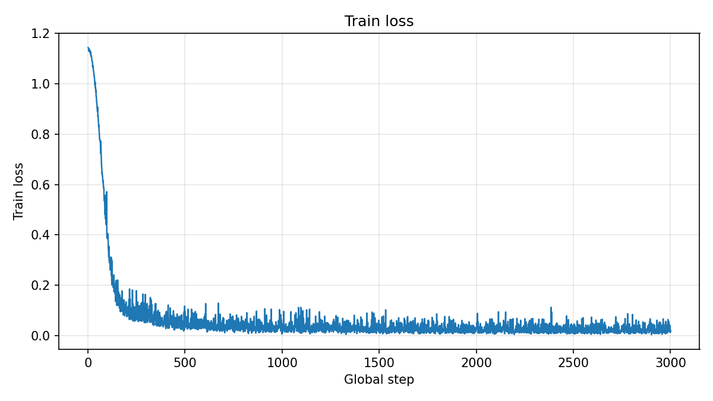
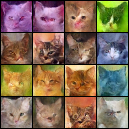
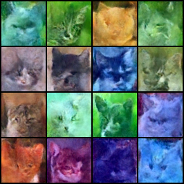
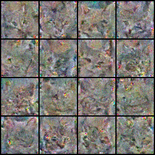

# Обучение диффузионной модели на датасете котов

В репозитории собрана учебная реализация обучения диффузионной модели для unconditional image generation на небольшом датасете изображений котов. В работе используются компоненты библиотеки `diffusers`: `UNet2DModel`, `DDPMScheduler`, `DDIMScheduler`, а также отдельные скрипты для обучения и генерации изображений.

## Выбранный датасет

- Название: `huggan/few-shot-cat`
- Ссылка: https://huggingface.co/datasets/huggan/few-shot-cat
- Количество изображений: `160`
- Поле с изображениями: `image`

Предобработка данных:

- перевод изображений в `RGB`
- `Resize` до `64x64`
- `RandomHorizontalFlip` на обучении
- `ToTensor`
- нормализация в диапазон `[-1, 1]`

Датасет загружается через `datasets.load_dataset`, поэтому отдельная ручная подготовка изображений не требуется.

## Архитектура модели

В качестве основной модели используется `UNet2DModel` из `diffusers`. Модель получает на вход зашумленное изображение и номер шага диффузии, после чего предсказывает добавленный шум.

Основные параметры UNet:

- `sample_size = 64`
- `in_channels = 3`
- `out_channels = 3`
- `layers_per_block = 2`
- `block_out_channels = (64, 128, 128, 256)`
- `down_block_types = ("DownBlock2D", "DownBlock2D", "AttnDownBlock2D", "DownBlock2D")`
- `up_block_types = ("UpBlock2D", "AttnUpBlock2D", "UpBlock2D", "UpBlock2D")`

Параметры диффузии:

- `num_train_timesteps = 1000`
- `beta_schedule = linear`
- `prediction_type = epsilon`

Обучение идет в режиме noise prediction:

- к чистому изображению добавляется случайный шум
- для каждого объекта в батче выбирается случайный timestep
- модель предсказывает этот шум
- функция потерь считается как `MSE(pred_noise, true_noise)`

## Запуск

Установка зависимостей:

```bash
pip install -r requirements.txt
```

Обучение:

```bash
python train.py --config config.yaml
```

Если нужно сохранить результаты в отдельную папку:

```bash
python train.py --config config.yaml --output_dir ./outputs
```

Генерация DDPM:

```bash
python sample.py --config config.yaml --checkpoint outputs/checkpoints/best.pt --method ddpm --steps 1000
```

Генерация DDIM:

```bash
python sample.py --config config.yaml --checkpoint outputs/checkpoints/best.pt --method ddim --steps 300
```

Основные параметры обучения из `config.yaml`:

- `train_batch_size = 16`
- `eval_batch_size = 16`
- `num_epochs = 300`
- `learning_rate = 1e-4`
- `gradient_accumulation_steps = 1`
- `lr_warmup_steps = 500`
- `mixed_precision = fp16`

Во время обучения сохраняются:

- лог по шагам: `output_dir/logs/train_log.csv`
- график функции потерь: `output_dir/loss_curve.png`
- preview-изображения: `output_dir/samples/`
- чекпоинты: `output_dir/checkpoints/best.pt` и `output_dir/checkpoints/last.pt`

## Результаты

### График loss

По графику видно, что основной спад происходит в начале обучения. Дальше loss выходит на низкий уровень и колеблется без срывов и резких выбросов. Для этого запуска общее число шагов получилось около `3000`, и к концу обучения процесс уже выглядит стабильным.



### Preview после обучения

Preview после `300` эпох уже заметно лучше ранних запусков: модель перестает выдавать только шум и начинает собирать общую структуру изображения. При этом по одному preview видно, что детализация все еще слабая, а часть изображений остается расплывчатой.



### Итоговые выборки DDPM и DDIM

#### DDPM, 1000 шагов

На DDPM-генерации уже получаются узнаваемые кошачьи морды. Большая часть изображений сохраняет общую форму головы, глаза, нос и расположение шерсти. Картинки все еще мыльные и местами смазанные, но по сравнению с более короткими прогонами результат заметно сильнее.



#### DDIM, 300 шагов

DDIM работает быстрее и тоже дает изображения с читаемой структурой кота, но результат менее стабильный. На части картинок форма головы читается нормально, на части изображение снова уходит в цветные пятна и теряет детали.



### Сравнение DDPM и DDIM

| Метод | Число шагов | Качество изображений | Время генерации |
| --- | --- | --- | --- |
| DDPM | 1000 | Лучший результат в этом эксперименте: большинство изображений похожи на котов, структура наиболее устойчивая | 48.0382 sec, GPU |
| DDIM | 300 | Быстрее, но слабее по качеству: структура есть не на всех примерах, больше смазанности и цветовых артефактов | 14.6817 sec, GPU |

По этому прогону DDPM оказался предпочтительнее по качеству, а DDIM дал более быстрый, но менее стабильный результат. Разница по времени почти в три раза, при этом визуально DDPM выигрывает достаточно заметно.

## Выводы

В работе был реализован полный пайплайн обучения диффузионной модели на датасете `huggan/few-shot-cat` и отдельные режимы генерации через DDPM и DDIM. По итогам обучения модель начала воспроизводить общую структуру изображений котов: на DDPM-сэмплинге видны морды, глаза и контуры головы, хотя детализация остается слабой.

Качество результата все еще ограничено:

- датасет очень маленький и содержит всего `160` изображений
- модель обучается с нуля
- разрешение `64x64` само по себе ограничивает детализацию

В текущем эксперименте `DDPM 1000 steps` дал более качественные изображения, а `DDIM 300 steps` оказался быстрее, но слабее по визуальному результату.

Если улучшать проект дальше, разумно:

- увеличить число эпох до `400-500`
- сохранить текущую архитектуру как базовую
- при необходимости аккуратно увеличить ширину UNet, не делая модель слишком тяжелой для Colab
